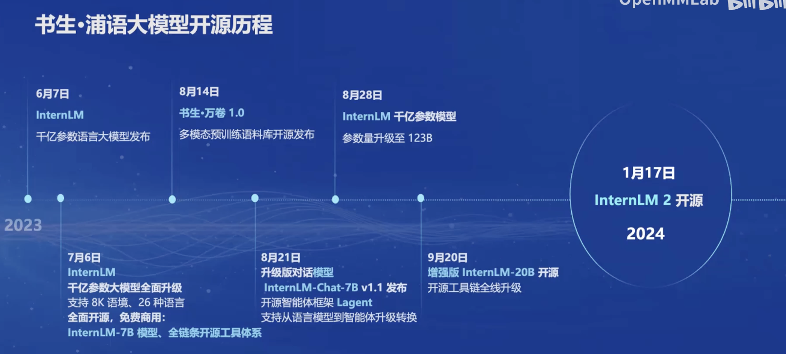
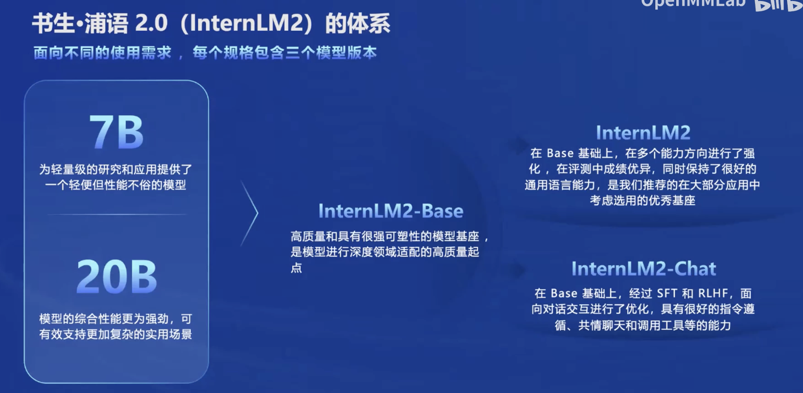
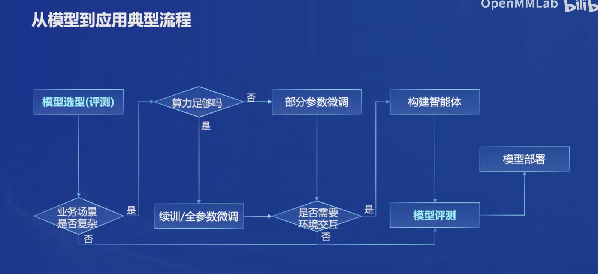
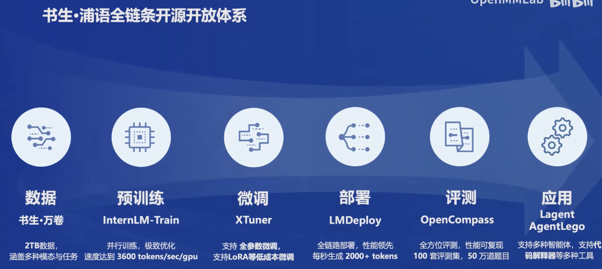

# 第一节课 《书生·浦语大模型全链路开源体系》
[书生·浦语官网](https://internlm.intern-ai.org.cn/) |
[课程链接](https://github.com/InternLM/Tutorial/tree/camp2) |
[视频课程链接](https://www.bilibili.com/video/BV1Vx421X72D/?vd_source=6a583c10668fbb7726a75f50cb76fe62) |
[InternLM2技术报告](https://arxiv.org/pdf/2403.17297) |
## 书生·浦语大模型开源历程

其中，InternLM-7B模型和全链条工具体系进行全面开源，免费商用🌟🌟

## 书生•浦语 2.0 (InternLM2） 的体系

## 模型到应用典型流程（模型的应用很重要！🛰️🛰️）

## 书生•浦语全链条开源开放体系
提供数据集->预训练->微调->部署->评测->应用全套工具🚁🚁

- 数据集：[书生万卷](https://github.com/opendatalab/WanJuan1.0)丰富多样的开放数据🚀🚀🚀
- 预训练：[InternLM-Train](https://github.com/InternLM/InternLM)只需修改配置文件，即可实现不同模型、不同数据集下的训练🛥️🛥️🛥️
- 微调框架：[XTuner](https://github.com/InternLM/xtuner)内置Lora、QLora等多种微调算法🚗🚗🚗
- 部署工具：[LMDeploy](https://github.com/InternLM/lmdeploy)支持高效部署，内置INT4、INT8量化实现🏖️🏖️🏖️
- 评测工具：[OpenCompass](https://github.com/open-compass/opencompass)全面的评测体系🏟️🏟️🏟️
- 智能体框架：[Lagent](https://github.com/InternLM/lagent)支持多种类型的智能体能力、灵活支持多种大语言模型⛲⛲⛲

# InternLM2技术报告阅读笔记
地址：https://arxiv.org/pdf/2403.17297
InternLM2是由上海人工智能实验室、商汤科技集团、香港中文大学和复旦大学共同开发的一款开源大型语言模型（LLM）。该模型在多个方面超越了其前身，包括在六个维度和30个基准测试中的全面评估、长文本建模和开放式主观评估中的性能表现。InternLM2采用了创新的预训练和优化技术，以实现卓越的性能。

**1. InternLM2的开发背景：**
首先介绍了大型语言模型（LLMs）的发展历程，如ChatGPT和GPT-4，这些模型在学术界和工业界广受欢迎，并引发了关于人工通用智能（AGI）时代到来的讨论。然而，复制这些模型的开源版本一直是一个挑战。

**2. InternLM2的主要特点：**
- **开源：** InternLM2模型在不同训练阶段和大小的版本都已开源，包括1.8B、7B和20B参数的模型。
- **长文本建模：** InternLM2能够有效捕捉长期依赖关系，并在预训练和微调阶段从4k令牌扩展到32k令牌，表现出在200k“针堆”测试中的卓越性能。
- **对齐策略：** 使用监督式微调（SFT）和一种新的基于条件的在线强化学习从人类反馈（COOL RLHF）策略，解决了人类偏好冲突和奖励黑客问题。

**3. InternLM2的预训练过程：**
文章详细介绍了InternLM2的预训练过程，包括数据准备、预训练设置和预训练阶段。数据准备涉及多种数据类型，包括文本、代码和长文本数据。预训练设置包括分词和超参数的选择。预训练阶段包括4k上下文训练、长文本训练和特定能力增强训练。

**4. 对齐（Alignment）：**
InternLM2使用SFT和RLHF来确保模型遵循人类指令并与人类价值观对齐。文章还介绍了COOL RLHF策略，它采用条件奖励模型来协调多样化的偏好，并通过多轮PPO训练来减轻每个阶段出现的奖励黑客问题。

**5. 评估与分析：**
文章提供了对InternLM2在各种下游任务上的性能评估，包括综合考试、语言和知识、推理和数学、编程、长文本建模和工具使用等六个关键领域的表现。此外，还包括对模型对齐能力的评价，如英语和中文的主观评估、指令遵循评估和条件奖励模型的消融研究。

**6. 数据污染讨论：**
文章讨论了数据污染对语言模型性能和可靠性的影响，并提出了一些解决策略。

**7. 结论：**
文章总结了InternLM2的主要贡献，包括在不同基准测试中的卓越性能、为社区提供模型发展各阶段的洞察、详尽的LLM数据准备指导以及创新的RLHF训练技术。

三个模型在不同方面表现的对比

