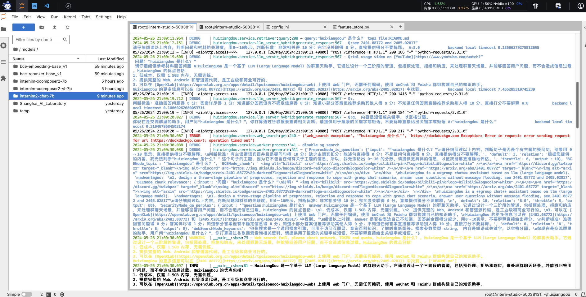

# 基础作业
## 1. 在茴香豆 Web 版中创建自己领域的知识问答助手🛩️🛩️🛩️
### 茴香豆 Web 版界面

### 设置正反例


### 五轮问答


### 反例问答

这个地方的反例回答，上面一个我觉得是出现问题，提出问题助手并没有给我回答，只给出了参考文档，肯定是有问题的😂😂

## 2.在 InternLM Studio 上部署茴香豆技术助手，根据教程文档搭建 茴香豆技术助手，针对问题"茴香豆怎么部署到微信群？"进行提问🚀🚀🚀

<p align="center">开发机上成功部署茴香豆技术助手</p>


<p align="center">针对问题"茴香豆怎么部署到微信群？"对茴香豆技术助手进行提问</p>

### 遇到的问题：
```python
sed -i '29s#.*#local_llm_path = "/root/models/internlm2-chat-7b"#' /root/huixiangdou/config.ini
```
在执行上面的命令时，需要把文件/root/huixiangdou/config.ini中原有的local_llm_path参数注释掉，否则可能出现问题，产生duplicate key问题
修改好的配置大致如下：


### 创建知识库
使用 InternLM 的 Huixiangdou 文档作为新增知识数据检索来源，在不重新训练的情况下，打造一个 Huixiangdou 技术问答助手。
首先，下载 Huixiangdou 语料：
```python
cd /root/huixiangdou && mkdir repodir

git clone https://github.com/internlm/huixiangdou --depth=1 repodir/huixiangdou
```
提取知识库特征，创建向量数据库。数据库向量化的过程应用到了 LangChain 的相关模块，默认嵌入和重排序模型调用的网易 BCE 双语模型，如果没有在 config.ini 文件中指定本地模型路径，茴香豆将自动从 HuggingFace 拉取默认模型。

除了语料知识的向量数据库，茴香豆建立接受和拒答两个向量数据库，用来在检索的过程中更加精确的判断提问的相关性，这两个数据库的来源分别是：

- 接受问题列表，希望茴香豆助手回答的示例问题
   - 存储在 huixiangdou/resource/good_questions.json 中
- 拒绝问题列表，希望茴香豆助手拒答的示例问题
  - 存储在 huixiangdou/resource/bad_questions.json 中
  - 其中多为技术无关的主题或闲聊
  - 如："nihui 是谁", "具体在哪些位置进行修改？", "你是谁？", "1+1"

在确定好语料来源后，运行下面的命令，创建 RAG 检索过程中使用的向量数据库：
```python
# 创建向量数据库存储目录
cd /root/huixiangdou && mkdir workdir 

# 分别向量化知识语料、接受问题和拒绝问题中后保存到 workdir
python3 -m huixiangdou.service.feature_store --sample ./test_queries.json
```
完成后，Huixiangdou 相关的新增知识就以向量数据库的形式存储在 workdir 文件夹下。

检索过程中，茴香豆会将输入问题与两个列表中的问题在向量空间进行相似性比较，判断该问题是否应该回答，避免群聊过程中的问答泛滥。确定的回答的问题会利用基础模型提取关键词，在知识库中检索 top K 相似的 chunk，综合问题和检索到的 chunk 生成答案。
### 运行茴香豆知识助手
我们已经提取了知识库特征，并创建了对应的向量数据库。现在，让我们来测试一下效果：

命令行运行：
```python
# 填入问题
sed -i '74s/.*/    queries = ["huixiangdou 是什么？", "茴香豆怎么部署到微信群", "今天天气怎么样？"]/' /root/huixiangdou/huixiangdou/main.py

# 运行茴香豆
cd /root/huixiangdou/
python3 -m huixiangdou.main --standalone
```
RAG 技术的优势就是非参数化的模型调优，这里使用的仍然是基础模型 InternLM2-Chat-7B， 没有任何额外数据的训练。面对同样的问题，我们的茴香豆技术助理能够根据我们提供的数据库生成准确的答案


# 进阶作业🏍️🏍️🏍️
A.【应用方向】 结合自己擅长的领域知识（游戏、法律、电子等）、专业背景，搭建个人工作助手或者垂直领域问答助手，参考茴香豆官方文档，部署到下列任一平台。
飞书、微信，可以使用 茴香豆 Web 版 或 InternLM Studio 云端服务器部署，涵盖部署全过程的作业报告和个人助手问答截图。

B.【算法方向】尝试修改 good_questions.json、调试 prompt 或应用其他 NLP 技术，如其他 chunk 方法，提高个人工作助手的表现。 完成不少于 400 字的笔记 ，记录自己的尝试和调试思路，涵盖全过程和改进效果截图


# RAG初识🚂🚂🚂
RAG（Retrieval Augmented Generation）技术，通过检索与用户输入相关的信息片段，并结合外部知识库来生成更准确、更丰富的回答。解决 LLMs 在处理知识密集型任务时可能遇到的挑战, 如幻觉、知识过时和缺乏透明、可追溯的推理过程等。提供更准确的回答、降低推理成本、实现外部记忆。

RAG 能够让基础模型实现非参数知识更新，无需训练就可以掌握新领域的知识。
