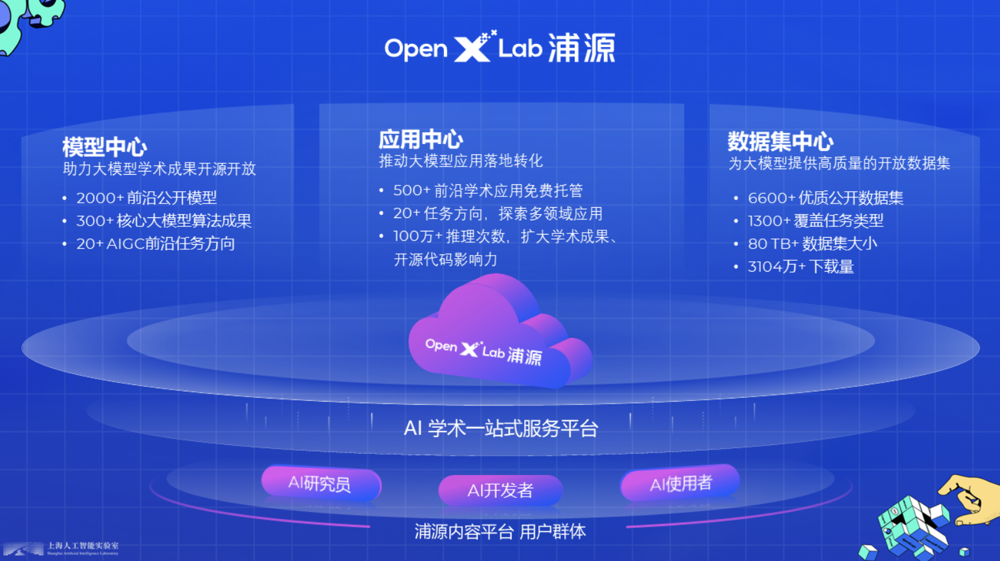

# 将自我认知的模型上传到 OpenXLab，并将应用部署到 OpenXLab
[OpenXLab 部署教程](https://github.com/InternLM/Tutorial/tree/camp2/tools/openxlab-deploy)

## OpenXLab·浦源平台介绍
OpenXLab 浦源平台以开源为核心，旨在构建开源开放的人工智能生态，促进学术成果的开放共享。
OpenXLab面向 AI 研究员和开发者提供 AI 领域的一站式服务平台，包含数据集中心、模型中心和应用中心，致力于推动人工智能对产学研各领域全面赋能，为构建人工智能开放生态，推动人工智能科研与技术突破、交叉创新和产业落地提供全方位的平台支撑。

