# LMDeploy环境部署
[官方教程](https://github.com/InternLM/Tutorial/blob/camp2/lmdeploy/README.md)

# 基础作业
### 环境部署
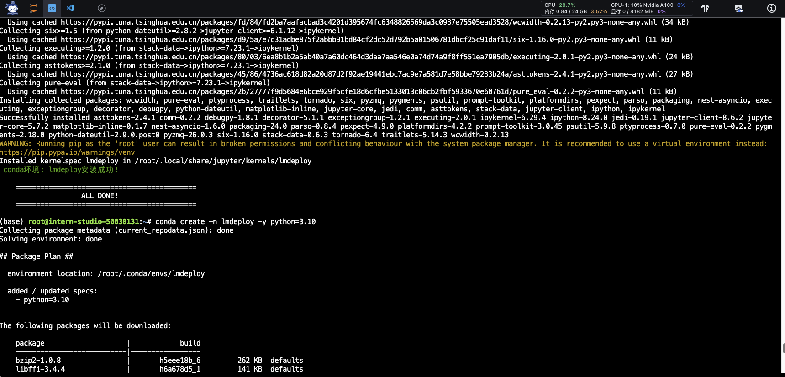

### 使用Transformer库运行模型
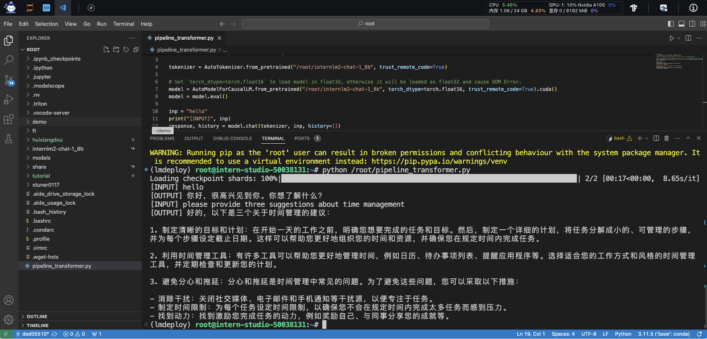

## 使用LMDeploy与模型对话
与InternLM2-Chat-1.8B大模型对话，速度明显比原生Transformer快
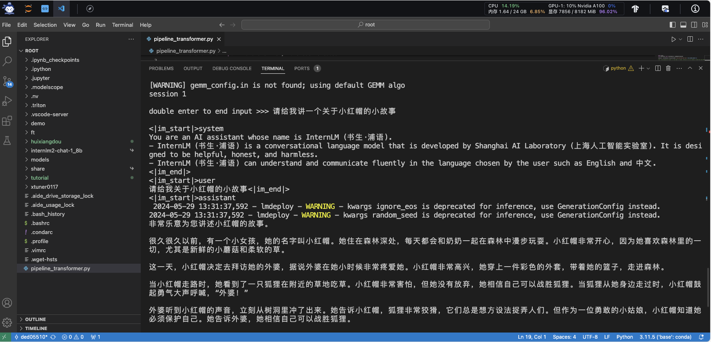

# 进阶作业
## 3.LMDeploy模型量化(lite)
主要包括 KV8量化和W4A16量化。总的来说，量化是一种以参数或计算中间结果精度下降换空间节省（以及同时带来的性能提升）的策略。
正式介绍 LMDeploy 量化方案前，需要先介绍两个概念：

- 计算密集（compute-bound）: 指推理过程中，绝大部分时间消耗在数值计算上；针对计算密集型场景，可以通过使用更快的硬件计算单元来提升计算速度。
- 访存密集（memory-bound）: 指推理过程中，绝大部分时间消耗在数据读取上；针对访存密集型场景，一般通过减少访存次数、提高计算访存比或降低访存量来优化。
常见的 LLM 模型由于 Decoder Only 架构的特性，实际推理时大多数的时间都消耗在了逐 Token 生成阶段（Decoding 阶段），是典型的访存密集型场景。

那么，如何优化 LLM 模型推理中的访存密集问题呢？ 我们可以使用KV8量化和W4A16量化。KV8量化是指将逐 Token（Decoding）生成过程中的上下文 K 和 V 中间结果进行 INT8 量化（计算时再反量化），以降低生成过程中的显存占用。W4A16 量化，将 FP16 的模型权重量化为 INT4，Kernel 计算时，访存量直接降为 FP16 模型的 1/4，大幅降低了访存成本。Weight Only 是指仅量化权重，数值计算依然采用 FP16（需要将 INT4 权重反量化）。
### 3.1 设置最大KV Cache缓存大小
KV Cache是一种缓存技术，通过存储键值对的形式来复用计算结果，以达到提高性能和降低内存消耗的目的。在大规模训练和推理中，KV Cache可以显著减少重复计算量，从而提升模型的推理速度。理想情况下，KV Cache全部存储于显存，以加快访存速度。当显存空间不足时，也可以将KV Cache放在内存，通过缓存管理器控制将当前需要使用的数据放入显存。

模型在运行时，占用的显存可大致分为三部分：模型参数本身占用的显存、KV Cache占用的显存，以及中间运算结果占用的显存。LMDeploy的KV Cache管理器可以通过设置--cache-max-entry-count参数，控制KV缓存占用剩余显存的最大比例。默认的比例为0.8。

### 3.2 使用W4A16量化
LMDeploy使用AWQ算法，实现模型4bit权重量化。推理引擎TurboMind提供了非常高效的4bit推理cuda kernel，性能是FP16的2.4倍以上。它支持以下NVIDIA显卡：

- 图灵架构（sm75）：20系列、T4
- 安培架构（sm80,sm86）：30系列、A10、A16、A30、A100
- Ada Lovelace架构（sm90）：40 系列

#### <font color="red">进阶作业1</font>：设置KV Cache最大占用比例为0.4，开启W4A16量化，以命令行方式与模型对话
设置KV Cache最大占用比例为0.4，开启W4A16量化命令：
```python
lmdeploy chat /root/internlm2-chat-1_8b-4bit --model-format awq --cache-max-entry-count 0.4
```
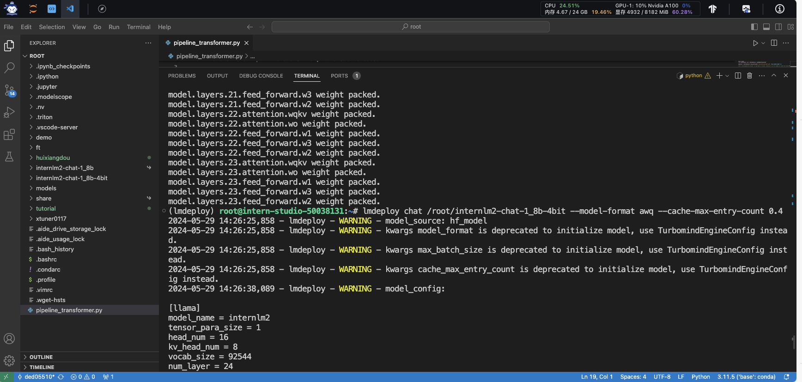
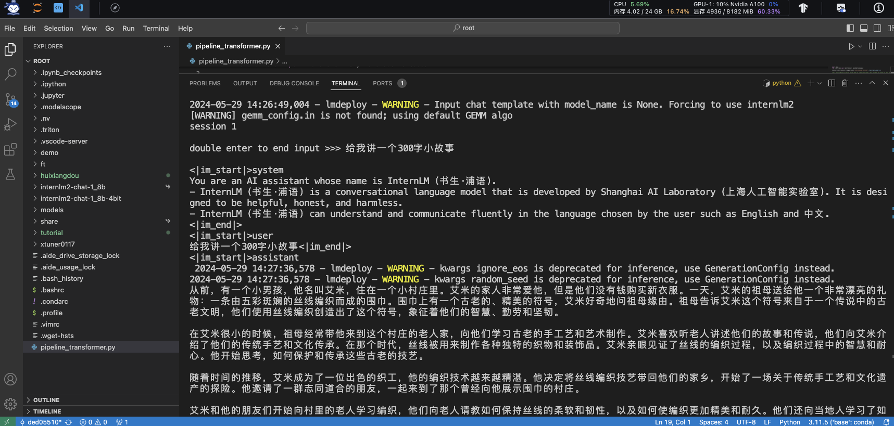


#### <font color="red">进阶作业2</font>：以API Server方式启动 lmdeploy，开启 W4A16量化，调整KV Cache的占用比例为0.4，分别使用命令行客户端与Gradio网页客户端与模型对话
## 4.LMDeploy服务(serve)
在生产环境下，我们有时会将大模型封装为API接口服务，供客户端访问。
来看下面一张架构图：
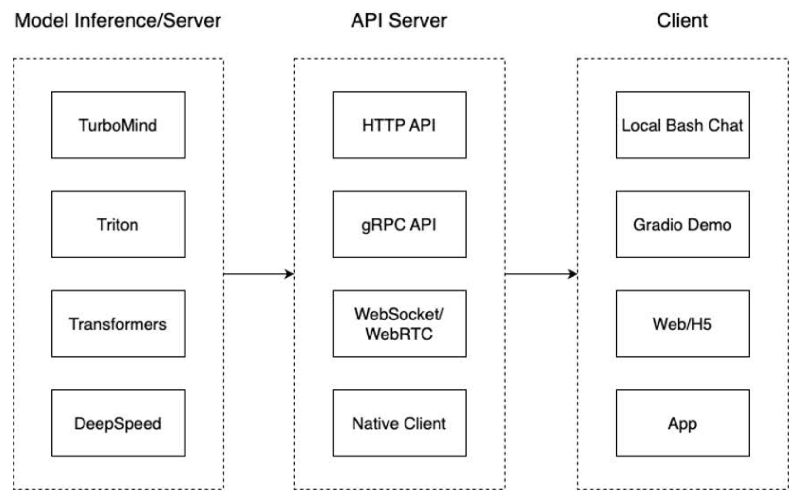
我们把从架构上把整个服务流程分成下面几个模块。

模型推理/服务。主要提供模型本身的推理，一般来说可以和具体业务解耦，专注模型推理本身性能的优化。可以以模块、API等多种方式提供。
- API Server。中间协议层，把后端推理/服务通过HTTP，gRPC或其他形式的接口，供前端调用。
- Client。可以理解为前端，与用户交互的地方。通过通过网页端/命令行去调用API接口，获取模型推理/服务。
值得说明的是，以上的划分是一个相对完整的模型，但在实际中这并不是绝对的。比如可以把“模型推理”和“API Server”合并，有的甚至是三个流程打包在一起提供服务。

### 4.1 启动API服务器
启动命令：
```python
lmdeploy serve api_server \
    /root/internlm2-chat-1_8b \
    --model-format hf \
    --quant-policy 0 \
    --server-name 0.0.0.0 \
    --server-port 23333 \
    --tp 1 \
    --cache-max-entry-count 0.4
```
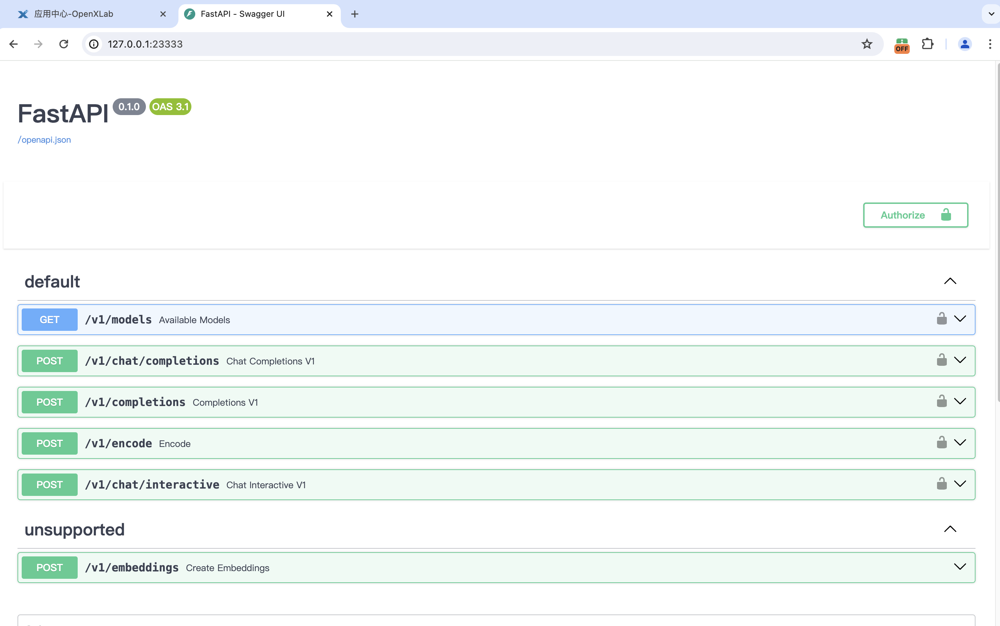
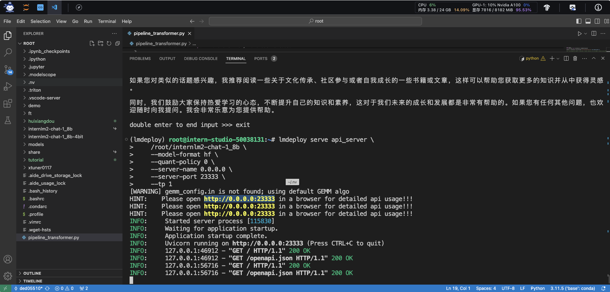
### 4.2 命令行客户端连接API服务器
我们在终端里新开了一个API服务器。 我们要新建一个命令行客户端去连接API服务器。首先通过VS Code新建一个终端
通过命令行窗口直接与模型对话：
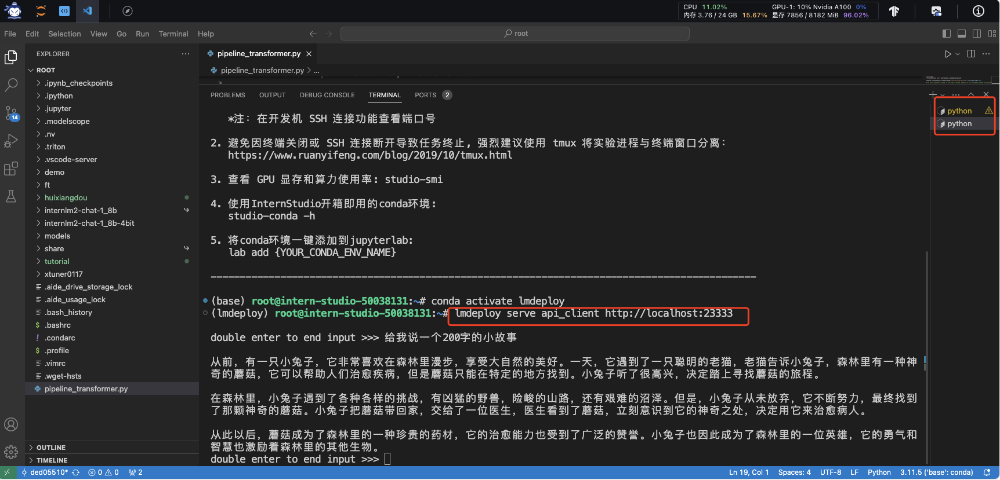
现在你使用的架构是这样的：
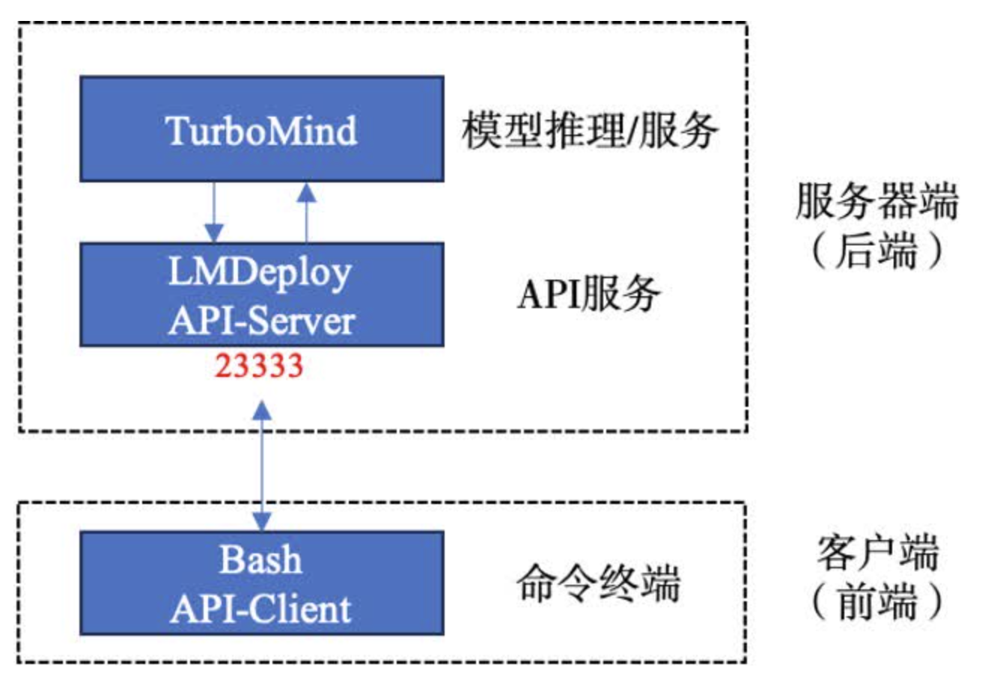

### 4.3 网页客户端连接API服务器
使用Gradio作为前端，启动网页客户端。
```python
lmdeploy serve gradio http://localhost:23333 \
    --server-name 0.0.0.0 \
    --server-port 6006
```
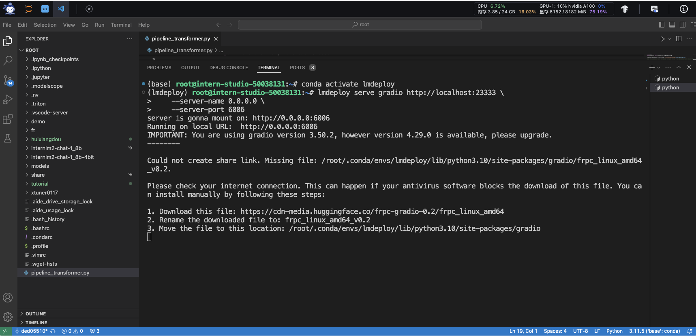
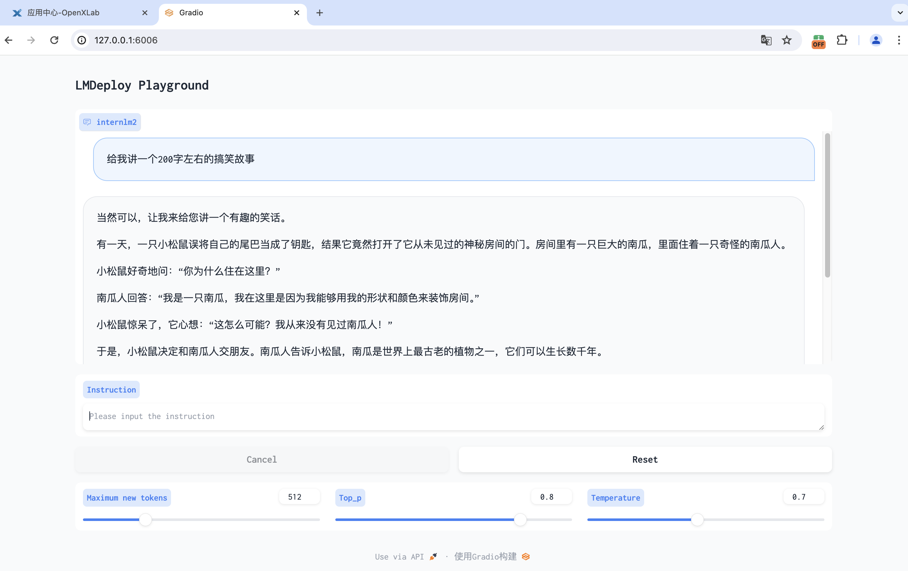
现在你使用的架构是这样的：
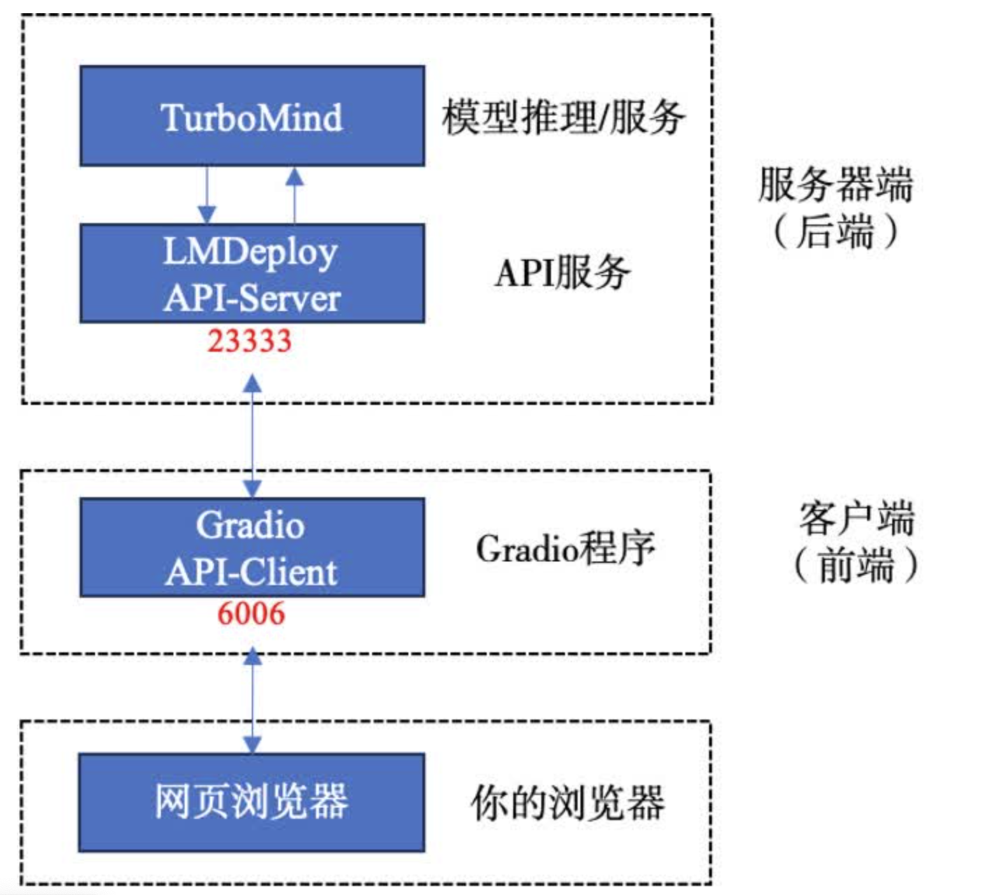


#### <font color="red">进阶作业3</font>：使用W4A16量化，调整KV Cache的占用比例为0.4，使用Python代码集成的方式运行internlm2-chat-1.8b模型
## 5.Python代码集成
在开发项目时，有时我们需要将大模型推理集成到Python代码里面。
### 5.1 Python代码集成运行1.8B模型
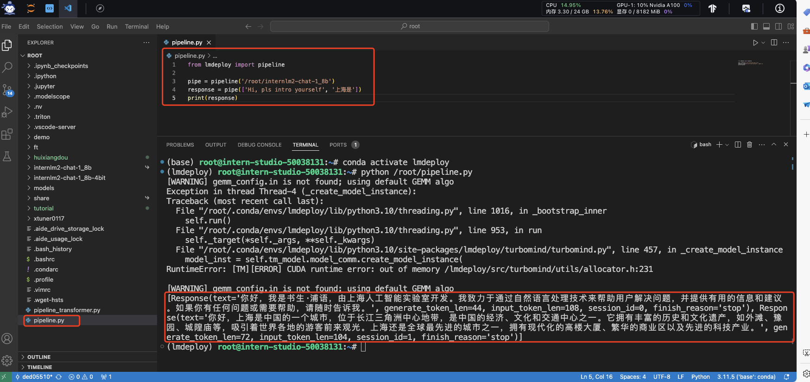
`pipeline.py`代码内容：
```python
from lmdeploy import pipeline

pipe = pipeline('/root/internlm2-chat-1_8b')
response = pipe(['Hi, pls intro yourself', '上海是'])
print(response)
```

> 代码解读：\
    - 第1行，引入lmdeploy的pipeline模块 \
    - 第3行，从目录“./internlm2-chat-1_8b”加载HF模型 \
    - 第4行，运行pipeline，这里采用了批处理的方式，用一个列表包含两个输入，lmdeploy同时推理两个输入，产生两个输出结果，结果返回给response \
    - 第5行，输出response

### 5.2 向TurboMind后端传递参数
我们通过向lmdeploy传递附加参数，实现模型的量化推理，及设置KV Cache最大占用比例。在Python代码中，可以通过创建TurbomindEngineConfig，向lmdeploy传递参数。
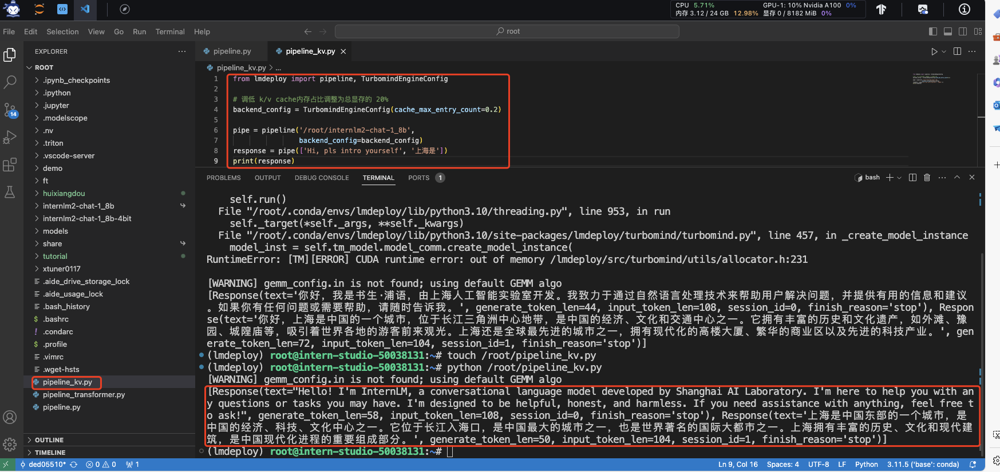
`pipeline_kv.py`文件内容：
```python
from lmdeploy import pipeline, TurbomindEngineConfig

# 调低 k/v cache内存占比调整为总显存的 20%
backend_config = TurbomindEngineConfig(cache_max_entry_count=0.4)

pipe = pipeline('/root/internlm2-chat-1_8b',
                backend_config=backend_config)
response = pipe(['Hi, pls intro yourself', '上海是'])
print(response)
```

#### <font color="red">进阶作业4</font>：使用 LMDeploy 运行视觉多模态大模型 llava gradio demo
## 6.拓展部分
### 6.1 使用LMDeploy运行视觉多模态大模型llava
最新版本的LMDeploy支持了llava多模态模型，下面演示使用pipeline推理llava-v1.6-7b。注意，运行本pipeline最低需要30%的InternStudio开发机。
`pipeline_llava.py`文件内容：
```python
from lmdeploy.vl import load_image
from lmdeploy import pipeline, TurbomindEngineConfig


backend_config = TurbomindEngineConfig(session_len=8192) # 图片分辨率较高时请调高session_len
# pipe = pipeline('liuhaotian/llava-v1.6-vicuna-7b', backend_config=backend_config) 非开发机运行此命令
pipe = pipeline('/share/new_models/liuhaotian/llava-v1.6-vicuna-7b', backend_config=backend_config)

image = load_image('https://raw.githubusercontent.com/open-mmlab/mmdeploy/main/tests/data/tiger.jpeg')
response = pipe(('describe this image', image))
print(response)
```

> 代码解读： \
第1行引入用于载入图片的load_image函数，第2行引入了lmdeploy的pipeline模块， \
第5行创建了pipeline实例 \
第7行从github下载了一张关于老虎的图片，如下：
> 
第8行运行pipeline，输入提示词“describe this image”，和图片，结果返回至response \
第9行输出response

得到输出结果：
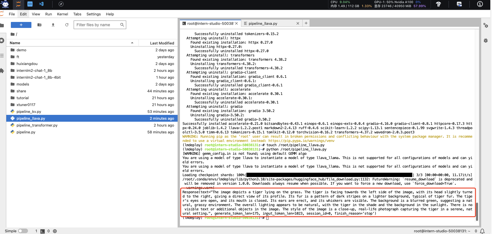

我们也可以通过Gradio来运行llava模型。新建python文件gradio_llava.py。
`gradio_llava.py`文件内容：
```python
import gradio as gr
from lmdeploy import pipeline, TurbomindEngineConfig


backend_config = TurbomindEngineConfig(session_len=8192) # 图片分辨率较高时请调高session_len
# pipe = pipeline('liuhaotian/llava-v1.6-vicuna-7b', backend_config=backend_config) 非开发机运行此命令
pipe = pipeline('/share/new_models/liuhaotian/llava-v1.6-vicuna-7b', backend_config=backend_config)

def model(image, text):
    if image is None:
        return [(text, "请上传一张图片。")]
    else:
        response = pipe((text, image)).text
        return [(text, response)]

demo = gr.Interface(fn=model, inputs=[gr.Image(type="pil"), gr.Textbox()], outputs=gr.Chatbot())
demo.launch()   
```
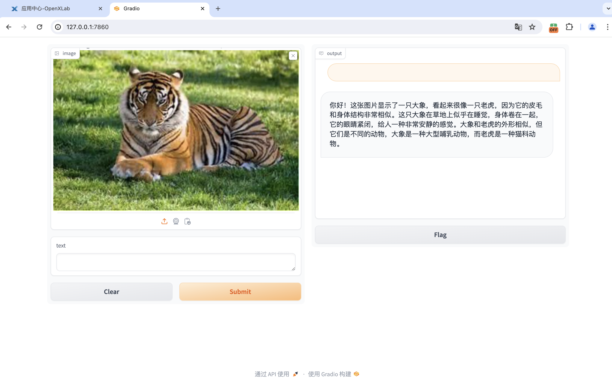
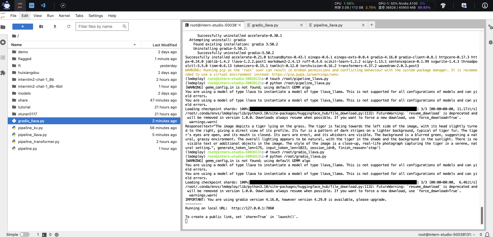


