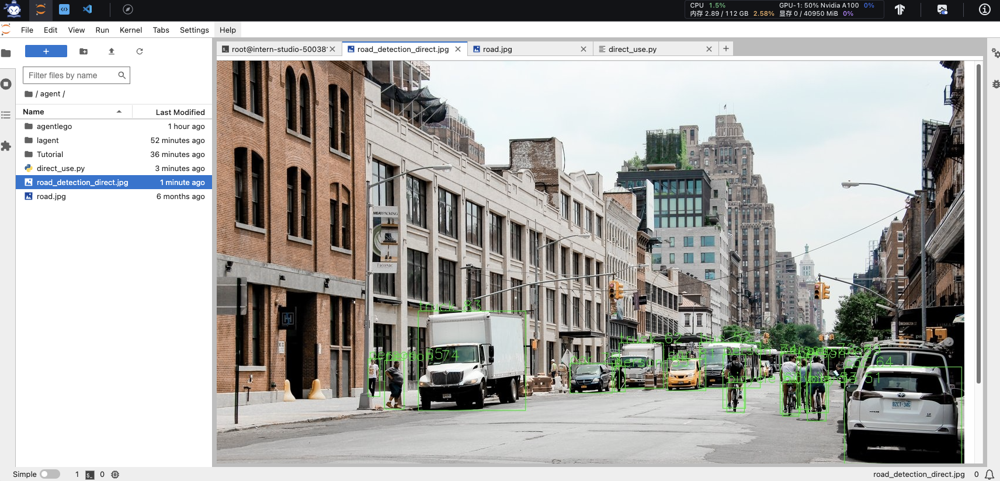

# Lagent & AgentLego 智能体应用搭建
[官方教程](https://github.com/InternLM/Tutorial/blob/camp2/agent/README.md)

## 1. 概述

### 1.1 Lagent 是什么

Lagent 是一个轻量级开源智能体框架，旨在让用户可以高效地构建基于大语言模型的智能体。同时它也提供了一些典型工具以增强大语言模型的能力。

Lagent 目前已经支持了包括 AutoGPT、ReAct 等在内的多个经典智能体范式，也支持了如下工具：

- Arxiv 搜索
- Bing 地图
- Google 学术搜索
- Google 搜索
- 交互式 IPython 解释器
- IPython 解释器
- PPT
- Python 解释器

### 1.2 AgentLego 是什么

AgentLego 是一个提供了多种开源工具 API 的多模态工具包，旨在像是乐高积木一样，让用户可以快速简便地拓展自定义工具，从而组装出自己的智能体。通过 AgentLego 算法库，不仅可以直接使用多种工具，也可以利用这些工具，在相关智能体框架（如 Lagent，Transformers Agent 等）的帮助下，快速构建可以增强大语言模型能力的智能体。

AgentLego 目前提供了如下工具：

<table align='center'>
    <tr align='center' valign='bottom'>
        <b><td>通用能力</td></b>
        <b><td>语音相关</td></b>
        <b><td>图像处理</td></b>
        <b><td>AIGC</td></b>
    </tr>
    <tr valign='top'>
    <td>
        <ul>
        <li>计算器</li>
        <li>谷歌搜索</li>
        </ul>
    </td>
    <td>
        <ul>
        <li>文本 -> 音频（TTS）</li>
        <li>音频 -> 文本（STT）</li>
        </ul>
    </td>
    <td>
        <ul>
        <li>描述输入图像</li>
        <li>识别文本（OCR）</li>
        <li>视觉问答（VQA）</li>
        <li>人体姿态估计</li>
        <li>人脸关键点检测</li>
        <li>图像边缘提取（Canny）</li>
        <li>深度图生成</li>
        <li>生成涂鸦（Scribble）</li>
        <li>检测全部目标</li>
        <li>检测给定目标</li>
        <li>SAM
            <ul>
            <li>分割一切</li>
            <li>分割给定目标</li>
            </ul>
        </li>
        </ul>
    </td>
    <td>
        <ul>
        <li>文生图</li>
        <li>图像拓展</li>
        <li>删除给定对象</li>
        <li>替换给定对象</li>
        <li>根据指令修改</li>
        <li>ControlNet 系列
            <ul>
            <li>根据边缘+描述生成</li>
            <li>根据深度图+描述生成</li>
            <li>根据姿态+描述生成</li>
            <li>根据涂鸦+描述生成</li>
            </ul>
        </li>
        <li>ImageBind 系列
            <ul>
            <li>音频生成图像</li>
            <li>热成像生成图像</li>
            <li>音频+图像生成图像</li>
            <li>音频+文本生成图像</li>
            </ul>
        </li>
    </td>
    </tr>
</table>

### 1.3 两者的关系

经过上面的介绍，我们可以发现，Lagent 是一个智能体框架，而 AgentLego 与大模型智能体并不直接相关，而是作为工具包，在相关智能体的功能支持模块发挥作用。

两者之间的关系可以用下图来表示：


初始化环境成功:


#### <font color="red">基础作业1</font>：完成 Lagent Web Demo 使用
## Lagent：轻量级智能体框架
带大家体验 Lagent 的 Web Demo，使用 Lagent 自定义工具，并体验自定义工具的效果。
详细文档可以访问：[Lagent：轻量级智能体框架](https://github.com/InternLM/Tutorial/blob/camp2/agent/lagent.md)
### 1. Lagent Web Demo
#### 1.1 使用 LMDeploy 部署
由于 Lagent 的 Web Demo 需要用到 LMDeploy 所启动的 api_server，因此我们首先按照下图指示在 vscode terminal 中执行如下代码使用 LMDeploy 启动一个 api_server。
```python
conda activate agent
lmdeploy serve api_server /root/share/new_models/Shanghai_AI_Laboratory/internlm2-chat-7b \
                            --server-name 127.0.0.1 \
                            --model-name internlm2-chat-7b \
                            --cache-max-entry-count 0.1
```


#### 1.2 启动并使用 Lagent Web Demo
按照下图指示新建一个 terminal 以启动 Lagent Web Demo。在新建的 terminal 中执行如下指令：
```python
conda activate agent
cd /root/agent/lagent/examples
streamlit run internlm2_agent_web_demo.py --server.address 127.0.0.1 --server.port 7860
```


在等待 LMDeploy 的 api_server 与 Lagent Web Demo 完全启动后（如下图所示），在本地进行端口映射，将 LMDeploy api_server 的23333端口以及 Lagent Web Demo 的7860端口映射到本地。可以执行：
```python
ssh -CNg -L 7860:127.0.0.1:7860 -L 23333:127.0.0.1:23333 root@ssh.intern-ai.org.cn -p 你的 ssh 端口号
```


接下来在本地的浏览器页面中打开 http://localhost:7860 以使用 Lagent Web Demo。首先输入模型 IP 为 127.0.0.1:23333，在输入完成后按下回车键以确认。并选择插件为 ArxivSearch，以让模型获得在 arxiv 上搜索论文的能力。
得到的结果：


#### <font color="red">进阶作业2</font>：使用 Lagent 或 AgentLego 实现自定义工具并完成调用
### 2. 用 Lagent 自定义工具
在本节中，我们将基于 Lagent 自定义一个工具。Lagent 中关于工具部分的介绍文档位于 https://lagent.readthedocs.io/zh-cn/latest/tutorials/action.html 。使用 Lagent 自定义工具主要分为以下几步：

继承 BaseAction 类
实现简单工具的 run 方法；或者实现工具包内每个子工具的功能
简单工具的 run 方法可选被 tool_api 装饰；工具包内每个子工具的功能都需要被 tool_api 装饰
下面我们将实现一个调用和风天气 API 的工具以完成实时天气查询的功能。
#### 2.1 创建工具文件
首先通过 touch /root/agent/lagent/lagent/actions/weather.py（大小写敏感）新建工具文件，该文件内容如下：
```python
import json
import os
import requests
from typing import Optional, Type

from lagent.actions.base_action import BaseAction, tool_api
from lagent.actions.parser import BaseParser, JsonParser
from lagent.schema import ActionReturn, ActionStatusCode

class WeatherQuery(BaseAction):
    """Weather plugin for querying weather information."""
    
    def __init__(self,
                 key: Optional[str] = None,
                 description: Optional[dict] = None,
                 parser: Type[BaseParser] = JsonParser,
                 enable: bool = True) -> None:
        super().__init__(description, parser, enable)
        key = os.environ.get('WEATHER_API_KEY', key)
        if key is None:
            raise ValueError(
                'Please set Weather API key either in the environment '
                'as WEATHER_API_KEY or pass it as `key`')
        self.key = key
        self.location_query_url = 'https://geoapi.qweather.com/v2/city/lookup'
        self.weather_query_url = 'https://devapi.qweather.com/v7/weather/now'

    @tool_api
    def run(self, query: str) -> ActionReturn:
        """一个天气查询API。可以根据城市名查询天气信息。
        
        Args:
            query (:class:`str`): The city name to query.
        """
        tool_return = ActionReturn(type=self.name)
        status_code, response = self._search(query)
        if status_code == -1:
            tool_return.errmsg = response
            tool_return.state = ActionStatusCode.HTTP_ERROR
        elif status_code == 200:
            parsed_res = self._parse_results(response)
            tool_return.result = [dict(type='text', content=str(parsed_res))]
            tool_return.state = ActionStatusCode.SUCCESS
        else:
            tool_return.errmsg = str(status_code)
            tool_return.state = ActionStatusCode.API_ERROR
        return tool_return
    
    def _parse_results(self, results: dict) -> str:
        """Parse the weather results from QWeather API.
        
        Args:
            results (dict): The weather content from QWeather API
                in json format.
        
        Returns:
            str: The parsed weather results.
        """
        now = results['now']
        data = [
            f'数据观测时间: {now["obsTime"]}',
            f'温度: {now["temp"]}°C',
            f'体感温度: {now["feelsLike"]}°C',
            f'天气: {now["text"]}',
            f'风向: {now["windDir"]}，角度为 {now["wind360"]}°',
            f'风力等级: {now["windScale"]}，风速为 {now["windSpeed"]} km/h',
            f'相对湿度: {now["humidity"]}',
            f'当前小时累计降水量: {now["precip"]} mm',
            f'大气压强: {now["pressure"]} 百帕',
            f'能见度: {now["vis"]} km',
        ]
        return '\n'.join(data)

    def _search(self, query: str):
        # get city_code
        try:
            city_code_response = requests.get(
                self.location_query_url,
                params={'key': self.key, 'location': query}
            )
        except Exception as e:
            return -1, str(e)
        if city_code_response.status_code != 200:
            return city_code_response.status_code, city_code_response.json()
        city_code_response = city_code_response.json()
        if len(city_code_response['location']) == 0:
            return -1, '未查询到城市'
        city_code = city_code_response['location'][0]['id']
        # get weather
        try:
            weather_response = requests.get(
                self.weather_query_url,
                params={'key': self.key, 'location': city_code}
            )
        except Exception as e:
            return -1, str(e)
        return weather_response.status_code, weather_response.json()
```

#### 2.2 获取 API KEY
为了获得稳定的天气查询服务，我们首先要获取 API KEY。首先打开 https://dev.qweather.com/docs/api/ 后，点击右上角控制台。
和风天气管理台：


#### 2.3 体验自定义工具效果
我们在两个 terminal 中分别启动 LMDeploy 服务和 Tutorial 已经写好的用于这部分的 Web Demo：
```python
conda activate agent
lmdeploy serve api_server /root/share/new_models/Shanghai_AI_Laboratory/internlm2-chat-7b \
                            --server-name 127.0.0.1 \
                            --model-name internlm2-chat-7b \
                            --cache-max-entry-count 0.1
```

```python
export WEATHER_API_KEY=在2.2节获取的API KEY
# 比如 export WEATHER_API_KEY=1234567890abcdef
conda activate agent
cd /root/agent/Tutorial/agent
streamlit run internlm2_weather_web_demo.py --server.address 127.0.0.1 --server.port 7860
```


#### <font color="red">基础作业2</font>：完成 AgentLego 直接使用部分
## AgentLego：组装智能体“乐高”
带大家直接使用 AgentLego 工具，体验 AgentLego 的 WebUI，以及基于 AgentLego 自定义工具并体验自定义工具的效果。
详细文档可以访问：[AgentLego：组装智能体“乐高”](https://github.com/InternLM/Tutorial/blob/camp2/agent/agentlego.md)。

### 1. 直接使用 AgentLego
下载 demo 文件:
```python
cd /root/agent
wget http://download.openmmlab.com/agentlego/road.jpg
```
由于 AgentLego 在安装时并不会安装某个特定工具的依赖，因此我们接下来准备安装目标检测工具运行时所需依赖。

AgentLego 所实现的目标检测工具是基于 mmdet (MMDetection) 算法库中的 RTMDet-Large 模型，因此我们首先安装 mim，然后通过 mim 工具来安装 mmdet。
```python
conda activate agent
pip install openmim==0.3.9
mim install mmdet==3.3.0
```
然后通过 touch /root/agent/direct_use.py（大小写敏感）的方式在 /root/agent 目录下新建 direct_use.py 以直接使用目标检测工具，direct_use.py 的代码如下：
```python
import re

import cv2
from agentlego.apis import load_tool

# load tool
tool = load_tool('ObjectDetection', device='cuda')

# apply tool
visualization = tool('/root/agent/road.jpg')
print(visualization)

# visualize
image = cv2.imread('/root/agent/road.jpg')

preds = visualization.split('\n')
pattern = r'(\w+) \((\d+), (\d+), (\d+), (\d+)\), score (\d+)'

for pred in preds:
    name, x1, y1, x2, y2, score = re.match(pattern, pred).groups()
    x1, y1, x2, y2, score = int(x1), int(y1), int(x2), int(y2), int(score)
    cv2.rectangle(image, (x1, y1), (x2, y2), (0, 255, 0), 1)
    cv2.putText(image, f'{name} {score}', (x1, y1), cv2.FONT_HERSHEY_SIMPLEX, 0.8, (0, 255, 0), 1)

cv2.imwrite('/root/agent/road_detection_direct.jpg', image)
```
接下来在执行 python /root/agent/direct_use.py 以进行推理。在等待 RTMDet-Large 权重下载并推理完成后，我们就可以看到如下输出以及一张位于 /root/agent 名为 road_detection_direct.jpg 的图片：
```python
truck (345, 428, 528, 599), score 83
car (771, 510, 837, 565), score 81
car (604, 518, 677, 569), score 75
person (866, 503, 905, 595), score 74
person (287, 513, 320, 596), score 74
person (964, 502, 999, 604), score 72
person (1009, 503, 1047, 602), score 69
person (259, 510, 279, 575), score 65
car (1074, 524, 1275, 691), score 64
person (993, 508, 1016, 597), score 62
truck (689, 483, 764, 561), score 62
bicycle (873, 551, 903, 602), score 60
person (680, 523, 699, 567), score 55
bicycle (968, 551, 996, 609), score 53
bus (826, 482, 930, 560), score 52
bicycle (1011, 551, 1043, 617), score 51
```





### 2 作为智能体工具使用
#### 2.2 使用 LMDeploy 部署
由于 AgentLego 的 WebUI 需要用到 LMDeploy 所启动的 api_server，因此我们首先按照下图指示在 vscode terminal 中执行如下代码使用 LMDeploy 启动一个 api_server。
```python
conda activate agent
lmdeploy serve api_server /root/share/new_models/Shanghai_AI_Laboratory/internlm2-chat-7b \
                            --server-name 127.0.0.1 \
                            --model-name internlm2-chat-7b \
                            --cache-max-entry-count 0.1
```


#### 2.3 启动 AgentLego WebUI
接下来我们按照下图指示新建一个 terminal 以启动 AgentLego WebUI。在新建的 terminal 中执行如下指令：
```python
conda activate agent
cd /root/agent/agentlego/webui
python one_click.py
```
在等待 LMDeploy 的 api_server 与 AgentLego WebUI 完全启动后（如下图所示），在本地进行端口映射，将 LMDeploy api_server 的23333端口以及 AgentLego WebUI 的7860端口映射到本地。可以执行：
```python
ssh -CNg -L 7860:127.0.0.1:7860 -L 23333:127.0.0.1:23333 root@ssh.intern-ai.org.cn -p 你的 ssh 端口号
```


#### <font color="red">进阶作业1</font>：完成 AgentLego WebUI 使用
#### 2.4 使用 AgentLego WebUI
接下来在本地的浏览器页面中打开 http://localhost:7860 以使用 AgentLego WebUI。首先来配置 Agent，如下图所示。

   1. 点击上方 Agent 进入 Agent 配置页面。（如①所示）
   2. 点击 Agent 下方框，选择 New Agent。（如②所示）
   3. 选择 Agent Class 为 lagent.InternLM2Agent。（如③所示）
   4. 输入模型 URL 为 http://127.0.0.1:23333 。（如④所示）
   5. 输入 Agent name，自定义即可，图中输入了 internlm2。（如⑤所示）
   6. 点击 save to 以保存配置，这样在下次使用时只需在第2步时选择 Agent 为 internlm2 后点击 load 以加载就可以了。（如⑥所示）
   7. 点击 load 以加载配置。（如⑦所示）


